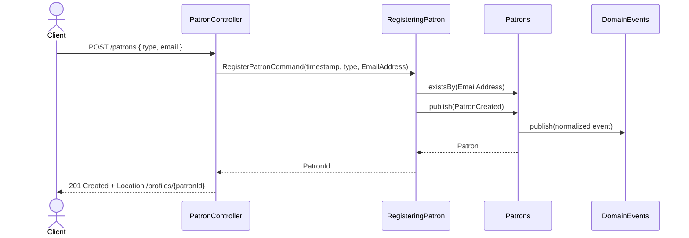

# Patron Registration Flow

The controller owns HTTP concerns and translates the raw `email` JSON string into an `EmailAddress` at the boundary, builds the timestamped registration command, the application service generates the identifier, checks uniqueness, and publishes `PatronCreated`, and the repository persists the new aggregate by handling `PatronCreated`.

## Why EmailAddress is a value object and not an entity

A patron's email is modelled as an immutable `EmailAddress` value object instead of a raw `String`:

- **No identity of its own.** Two patrons with the same email have the *same* email value. There is nothing to identify or mutate about it independently, so it has no id and no lifecycle. Entities are things with an identity that changes over time; an email does not.
- **Value-based equality and immutability.** `EmailAddress` is `final`, holds a single normalized `String`, and implements `equals`/`hashCode` from that value. The value is normalized once at construction (trim + lowercase), so equality and DB uniqueness agree on the same canonical form.
- **Invariants are enforced at the boundary of the model.** Invalid addresses cannot be constructed: `EmailAddress.of(...)` rejects null, blank, oversized, and clearly malformed values. There is no state in which an aggregate can hold a bad email.
- **Self-validating, reuse-friendly concept.** Any future use case (notifications, patron profile) consumes a guaranteed-valid value instead of re-implementing validation.

## Domain validation vs request validation

`EmailAddress.of(...)` performs **domain validation** — it protects the aggregate from ever holding an invalid value. The REST layer performs **request validation** with `@NotNull` (and Jackson/bean validation for required JSON fields), which produces a `VALIDATION_FAILED` response for missing input. An invalid-but-present email reaches the controller, fails domain validation, and maps to `INVALID_EMAIL_ADDRESS` (400). A duplicate email fails the uniqueness check in the application service and maps to `EMAIL_ADDRESS_ALREADY_REGISTERED` (409). The domain model contains no Spring MVC validation annotations.

## Validation strategy

The documented, pragmatic strategy (not full RFC 5321/5322 conformance):

- required, trimmed, lowercase-normalized, max 254 characters
- local part: one or more allowed characters (letters, digits, and the standard printable specials)
- domain: dot-separated DNS labels, each label starting and ending with an alphanumeric, at least one label
- out of scope by design: internationalized (IDN) addresses, comments, quoted local parts, and other exotic RFC edge cases
