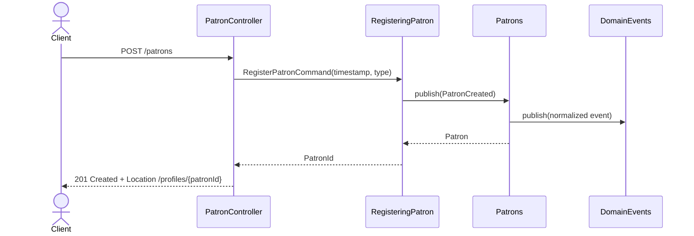

# Patron Registration Flow

The controller owns HTTP concerns and builds the timestamped registration command, the application service generates the identifier and publishes `PatronCreated`, and the repository persists the new aggregate by handling `PatronCreated`.